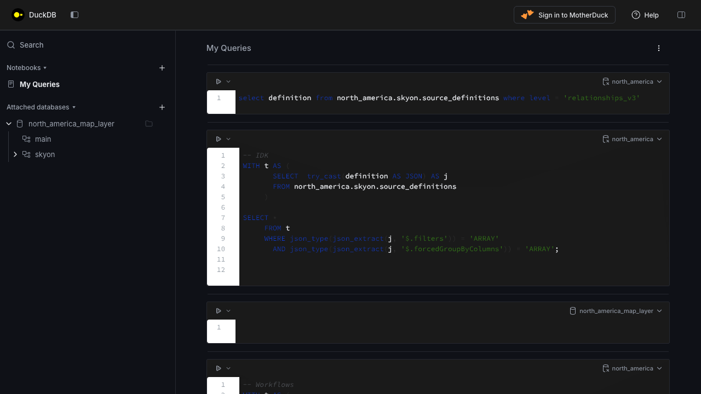

# DuckDB UI Dark Mode Extension

A companion extension for the [DuckDB UI](https://github.com/duckdb/duckdb-ui) that adds dark mode support by injecting CSS overrides into the UI's HTML responses via a lightweight local proxy.



## How It Works

The DuckDB UI extension serves its frontend by proxying `ui.duckdb.org` through a local HTTP server on port 4213. This dark mode extension starts a second proxy on port 4214 that:

1. Forwards all requests to the upstream UI server (port 4213)
2. Intercepts HTML responses and injects a `<style>` block before `</head>`
3. The injected CSS overrides the UI's design tokens (CSS custom properties) for a dark color scheme

## Requirements

- The [DuckDB UI extension](https://duckdb.org/docs/stable/core_extensions/ui.html) must be installed and running

## Quick Start

```sql
-- Install and start the UI server (if not already running)
INSTALL ui;
LOAD ui;
CALL start_ui_server();

-- Start the dark mode proxy (opens browser automatically)
CALL start_dark_ui();
```

This opens `http://localhost:4214/` — the full DuckDB UI with dark mode applied.

## Settings

| Setting | Default | Description |
|---------|---------|-------------|
| `ui_dark_mode` | `'auto'` | `'auto'` = follow OS preference, `'on'` = always dark, `'off'` = disabled |
| `ui_dark_port` | `4214` | Port for the dark mode proxy server |

```sql
-- Force dark mode regardless of OS setting
SET ui_dark_mode = 'on';
CALL start_dark_ui();

-- Stop the dark mode proxy
CALL stop_dark_ui();
```

Settings can also be set via environment variables: `ui_dark_mode`, `ui_dark_port`.

## Building

```sh
git submodule update --init --recursive
make
```

Run the built DuckDB shell with the extension auto-loaded:

```sh
./build/release/duckdb
```

## Testing

```sh
make test
```
